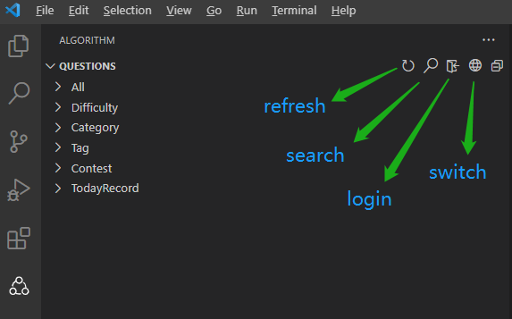
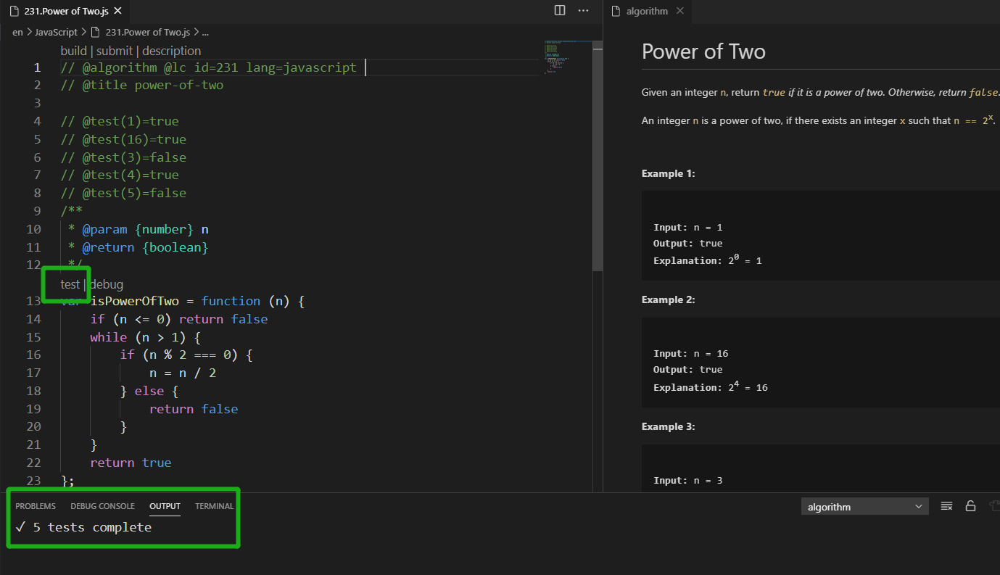

# algorithm

An excellent vscode extension for leetcode.

## Document | [中文文档](./docs/README_zh-CN.md)

## Quick Start

## Support

-   javascript
-   typescript
-   python3
-   golang
-   java
-   c++
-   shell
-   sql

**will support other language soon**

## Main Features

-   write testcase in the file and run test in local, support link list and tree

-   debug the testcase

-   memo

-   multi-solution and history

-   support import module, bundle code and copy the build code.(only support js/ts)

-   contain contest (Do not submit directly when you attending weekly contest,
    copy the code and submit in browser instead.)

## Other Features

-   search question
-   contain daily challenge
-   support login in https://leetcode.com/ and https://leetcode-cn.com/

## Requirements

-   javascript/typescript

    -   Nodejs 12+

        > The `test` and `debug` will use `node` to execute.
        > Make sure that `node` is in your PATH environment variable.If you're using nvm, you may need to set the `algorithm.nodePath` in the VS Code settings.

-   python3

    -   Make sure that `python3` is in your PATH environment variable.
    -   install the official Python extension(https://code.visualstudio.com/docs/python/python-tutorial)

-   golang

    -   Make sure that `go` is in your PATH environment variable.
    -   install the official golang extension

-   java

    -   Make sure that `java`,`javac` is in your PATH environment variable.Or [set javaPath and javacPath](#setting)
    -   install the official java extension (https://code.visualstudio.com/docs/java/java-tutorial)
        > ensure the extension `Debugger for Java`>=v0.33.1 or the extension `Java Extension Pack`>=v0.14.0

-   c++

    -   Install GCC C++ compiler (g++).And make sure that `g++` is in your PATH environment variable.
    -   Install the C++ extension for VS Code.
        more detail in the website (https://code.visualstudio.com/docs/cpp/config-linux)

## Pick a question

Click the question in the `algorithm view`

## Switch code lang

press `ctrl+shift+p` and run the Command `algorithm:switch default language`

## Switch database

press `ctrl+shift+p` and run the Command `algorithm:switch default database`

## shortcut buttons

> Just click the shortcut button in the `view toolbar` to

-   refresh question
-   search question
-   login in
-   switch endpoint
-   collapse all

## Switch endpoint

### current support:

-   leetcode.com
-   leetcode-cn.com

> Note: The accounts of different endpoints are not shared.

## Login in

The way to login in referred to the official extension [vscode-leetcode](https://github.com/LeetCode-OpenSource/vscode-leetcode).

-   leetcode.com support github and cookie login.
-   leetcode-cn.com support account,github and cookie login.

## Test in the file

The code contains default testcase from question preview.

By clicking the test codelens hover in the vscode to run the test in local.

You can add customized testcase in the code like `// @test(param)=result`.

## Debug

You only need to set breakpoints on the testcase line and set breakpoints for the code.

:tada: Then enjoy debugging!

> Note:If you are debugging java,ensure the extension `Debugger for Java`>=v0.33.1 or the extension `Java Extension Pack`>=v0.14.0. If you build error when debugging,press `ctrl+shift+p` and run the Command `Java:Clean Java Language Server Workspace`.

## Submit

Click the submit hover to submit your code. You can use build to view the final submitted code.

## Memo

You can create different folders and add questions to them.

## Multi-solution and History

1. Click the history codelens, you will see the answers and submit history.
2. Add the comment `@desc $(method name)` in the code, it will generate description or comment when `submit` or use `new leetcode answer` command.
3. Right click the mouse,you will see the `new leetcode answer` command.This command will save your old answer and init a new answer.You can scan it in 4.
4. the old answers
5. submit solution save in local
6. submit solution save in leetcode

## Weekly Contest

When you participate in Weekly Contest, you may choose c++,java,python. Because they have the built-in library like STL that contains priority queue,order set etc.

Now you have another choice.

### **Attention!**

Do not submit directly when you attend weekly contest,click `build` and then
click `copy` to copy code , finally paste the code in browser and submit.

### build code & copy code

This is useful in the weekly contest.

-   click the build codelens hover.

-   focus the code view then click the copy icon.

> The code import module [algm](https://github.com/supperchong/algm) which contains many useful function and data structure, such as `priority queue`,`Segment tree`, `union–find` ,`skip list`. :rocket: Thanks to treeshake and rollup, the bundle code is very clean.

## Setting

press `ctrl+,` or open `file->Preferences->Settings`, you will see User and Workspace setting. Workspace setting will override User setting.
open `Extensions->algorithm`,you will see the settings:

| Setting Name    | Description                                                                                       | Default Value |
| --------------- | ------------------------------------------------------------------------------------------------- | ------------- |
| Auto Import Str | The string will be inserted at the beginning of the coding file                                   | ""            |
| Base Dir        | The path of the folder to save the problem files                                                  | $HOME/.alg    |
| Code Lang       | default code language                                                                             | JavaScript    |
| Lang            | Specify the active endpoint.support leetcode.com and leetcode-cn.com                              | leetcode.com  |
| Node Path       | The absolute pathname of the executable that started the Node.js process. eg: /usr/local/bin/node | node          |
| javaPath        | The absolute pathname of java                                                                     | java          |
| javacPath       | The absolute pathname of javac                                                                    | javac         |
| Database        | default sql language                                                                              | MySQL         |

## Thanks

Thanks to the official extension [vscode-leetcode](https://github.com/LeetCode-OpenSource/vscode-leetcode), the algorithm extension
has reference some design and the login method.
